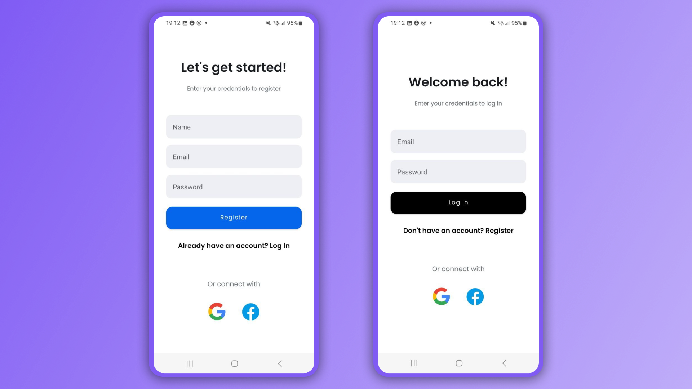
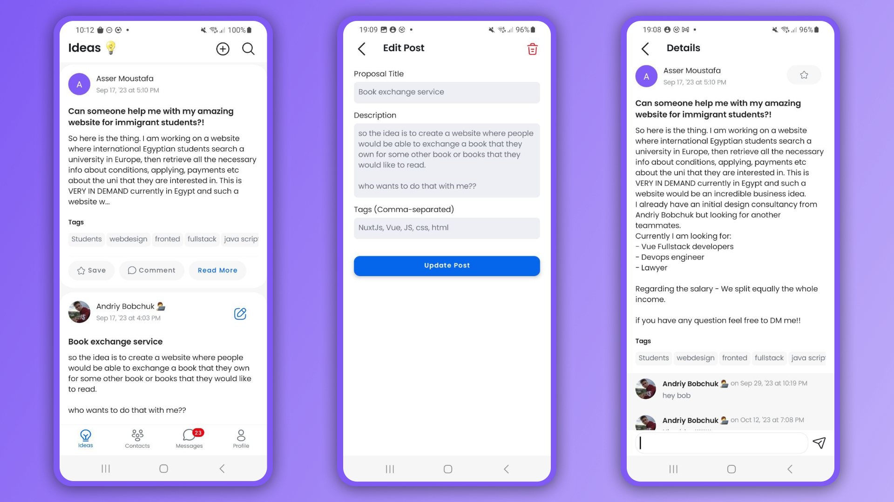
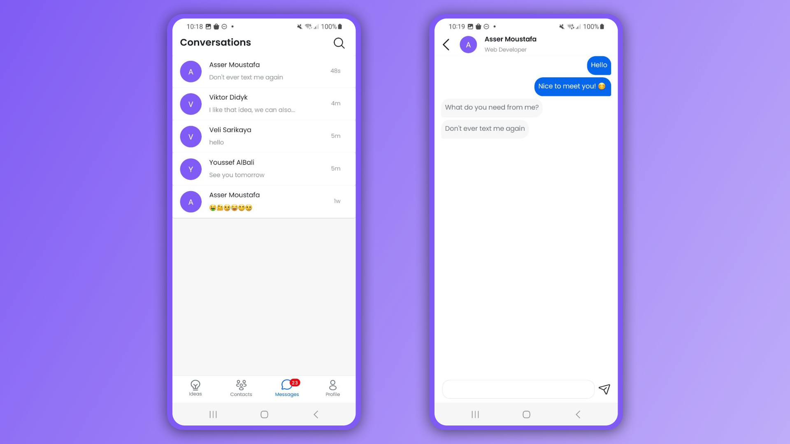
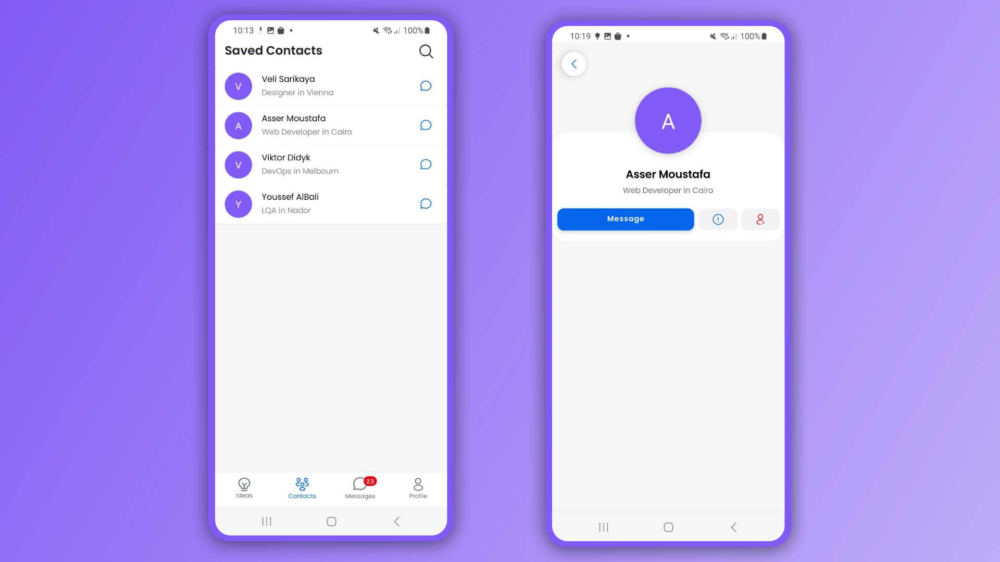
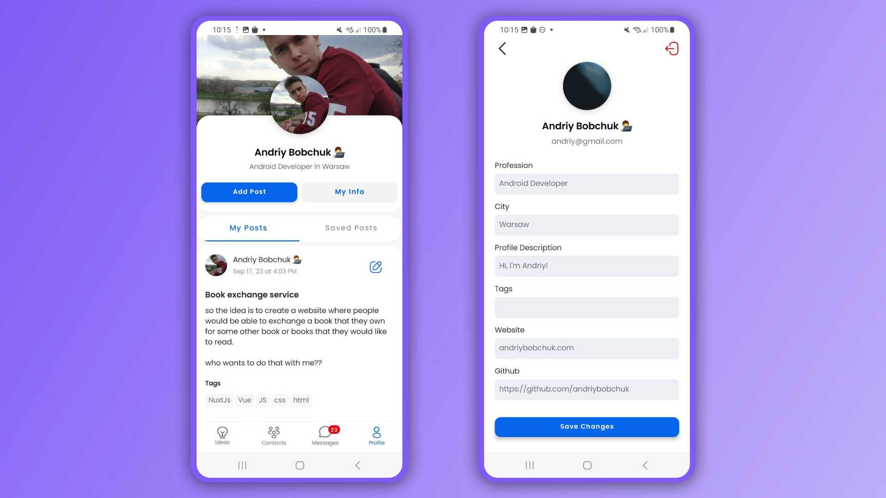

# CoCreate Mobile Application

## Introduction

CoCreate is a novel mobile application designed to revolutionize collaborative project development, particularly in the field of information technology and beyond. This platform connects creative thinkers globally, allowing them to unite and collaborate on their projects of choice. By integrating modern development practices, CoCreate offers a robust, scalable, and intuitive environment for fostering innovation and teamwork.

## Features

- **Project Collaboration:** Share, view, and discuss project ideas with a global community of developers and creative thinkers.
- **User Profiles:** Complete and share user profiles to highlight skills and interests, facilitating better team formation and collaboration.
- **In-App Messaging:** Communicate with peers using the built-in messenger to discuss projects, ideas, or just network.
- **Post & Comment System:** Users can create posts about their project ideas and comment on others' posts to offer feedback or express interest.
- **Real-time Notifications:** Stay updated with project developments, messages, and interactions through real-time notifications.

## Screenshots

Below are some screenshots of the CoCreate application showcasing various features and the user interface:


*Login and Register Screens*


*View and share project ideas.*


*Built-in messenger for user communication.*


*View and edit user conatcts.*


*View and Edit User Profile.*

## Technologies

- **Platform:** Android (Kotlin)
- **Architecture:** Clean Architecture, MVVM
- **Dependency Injection:** Dagger-Hilt
- **Asynchronous Programming:** Coroutines and Flow
- **Database:** Firebase Firestore
- **Authentication:** Firebase Authentication
- **UI Design:** Jetpack Compose

## Getting Started

### Prerequisites

- Android Studio Arctic Fox or later
- JDK 11 or later

### Setting Up the Development Environment

1. **Clone the repository:**
```
git clone https://github.com/andriybobchuk/coCreate
```

3. **Open the project in Android Studio:**
- Open Android Studio and select "Open an existing project"
- Navigate to the cloned repository and open it

3. **Sync the Project with Gradle Files:**
- Android Studio should automatically prompt you to do this. If not, you can trigger a sync manually from the toolbar.

4. **Run the application:**
- Set up an emulator or connect a physical device
- Run the app by pressing the 'Run' button in Android Studio

### Environment Variables

- **Firebase Configuration:** Ensure you have the `google-services.json` file from Firebase placed in the appropriate `app` directory.
- **Firebase API Key:** Ensure you have a valid SERVER_CLIENT API key under the `com.andriybobchuk.cocreate.feature.auth.data.data_source` directory to use Firebase services in your project.

## Documentation

- **API Reference:** [How to setup Firebase](https://firebase.google.com/docs/database/android/start)
- **Architecture Diagrams:** [Folder with Architecture Diagrams](architecture_diagrams)
- **Wiki:** Sorry, no Wiki :)

## Contributing

I welcome contributions! If you would like to help improve CoCreate, please follow these steps:

1. Fork the repository
2. Create your feature branch (`git checkout -b feature/AmazingFeature`)
3. Commit your changes (`git commit -m 'Add some AmazingFeature'`)
4. Push to the branch (`git push origin feature/AmazingFeature`)
5. Open a pull request

## License

Distributed under the License. See `LICENSE` for more information.

## Contact

- **Project Lead:** Andriy Bobchuk - andriybobchuk@gmail.com
